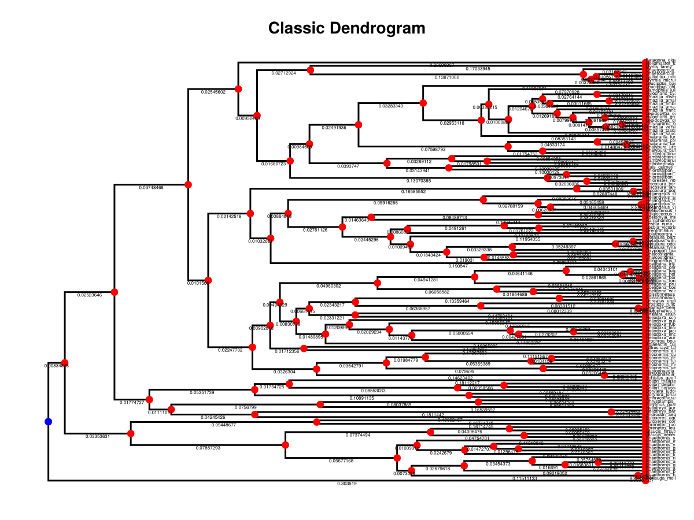
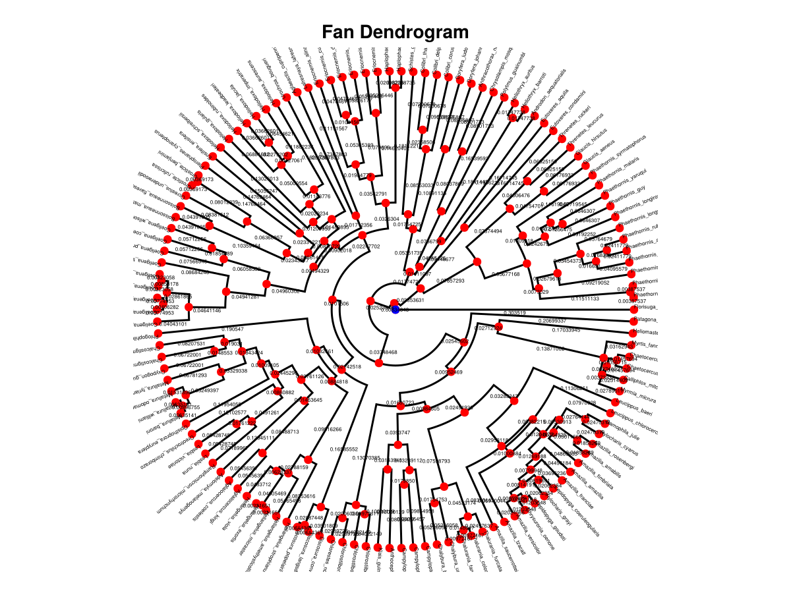
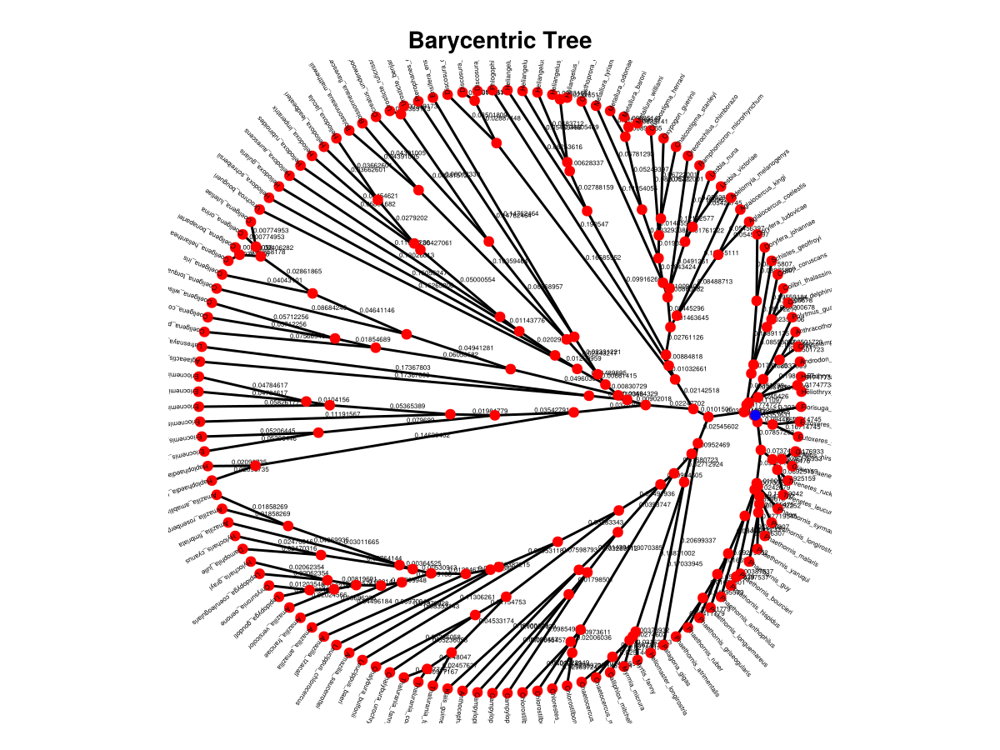
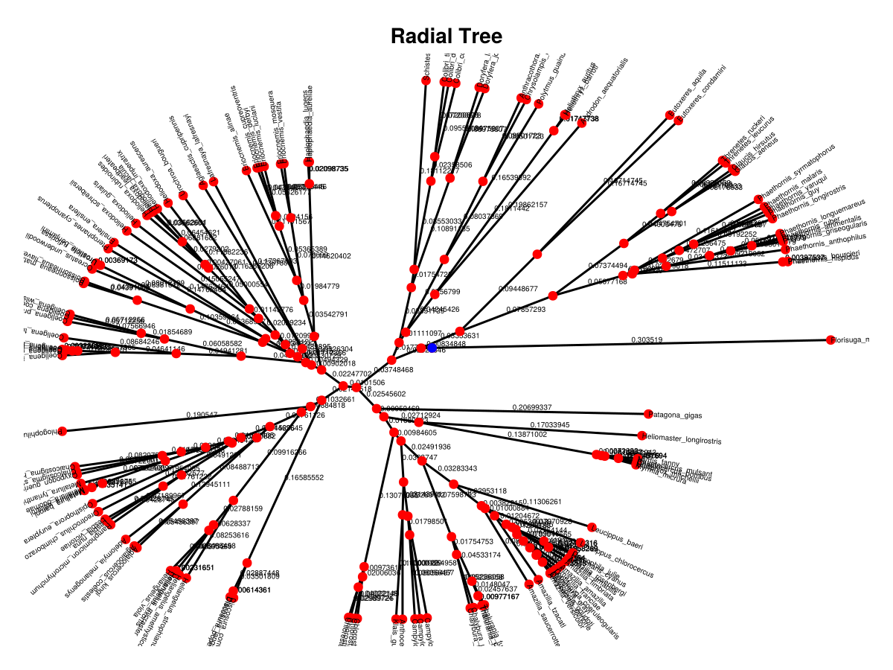
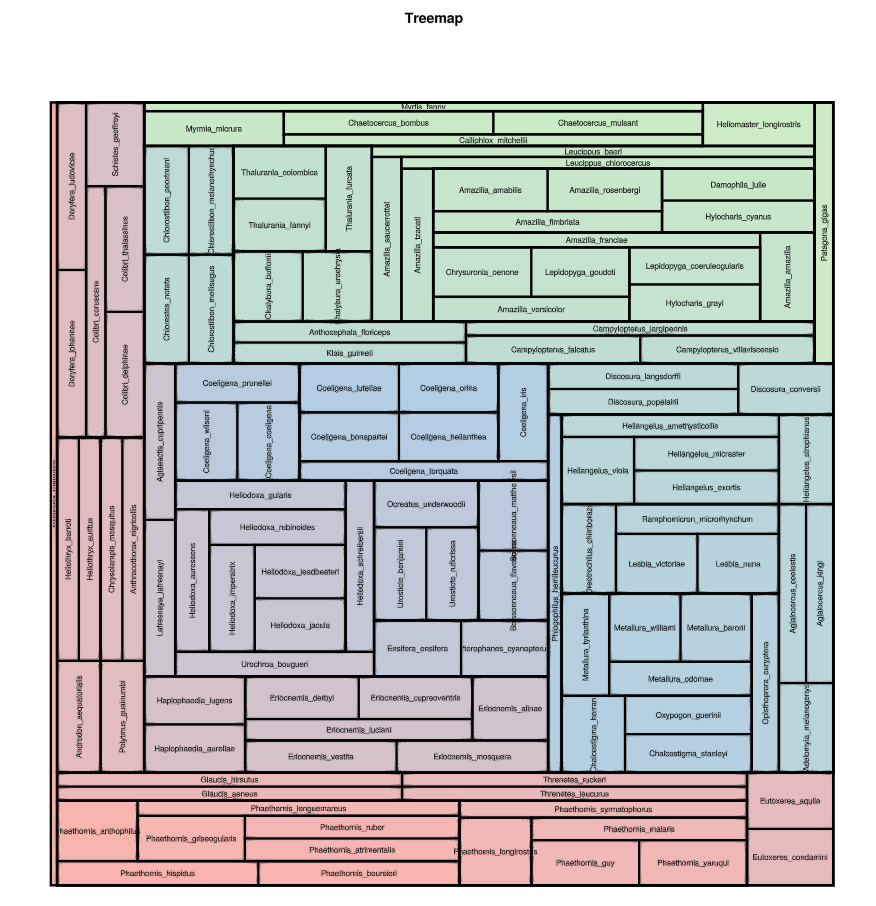
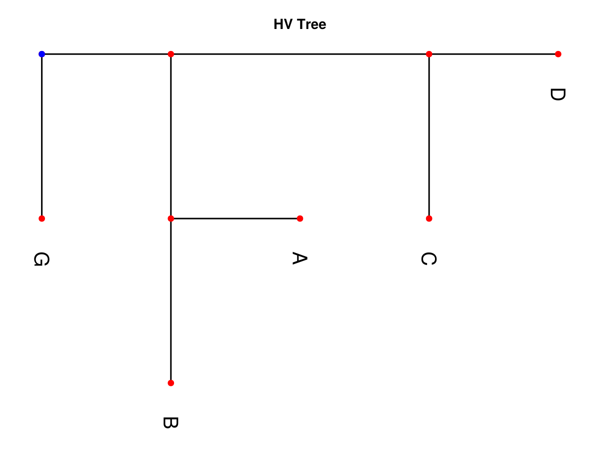

# Plotting

Allows visualizations for Phylo.jl

## Classic Dendrogram

```julia
f = Figure()
ax = Axis(f[1,1], title="Classic Dendrogram")

Recipes.dendrogramplot!(complex, fontsize=10)

hidedecorations!(ax)
hidespines!(ax)

current_figure()
```


## Radial Dendrogram

```julia
f = Figure()
ax = Axis(f[1,1], title="Fan Dendrogram", aspect=DataAspect())

Recipes.dendrogramplot!(complex, layout=:fan, fontsize=4)

hidedecorations!(ax)
hidespines!(ax)

current_figure()
```


## Barycentric Plot

```julia
f = Figure()
ax = Axis(f[1,1], title="Barycentric Tree", aspect=DataAspect())

Recipes.treeplot!(complex, layout=:barycentric, fontsize=4)

hidedecorations!(ax)
hidespines!(ax)

current_figure()
```



## Radial Plot

```julia
f = Figure()
ax = Axis(f[1,1], title="Radial Tree", aspect=DataAspect())

Recipes.treeplot!(complex, layout=:radial, fontsize=5)

hidedecorations!(ax)
hidespines!(ax)

current_figure()
```



## Treemap Plot

```julia
f = Figure()
ax = Axis(f[1,1], title="Treemap")

Recipes.treemapplot!(simple)

hidedecorations!(ax)
hidespines!(ax)

current_figure()
```


## HV Plot

```julia
f = Figure()
ax = Axis(f[1,1], title="HV Tree")

Recipes.hvplot!(simple, fontsize=20)

hidedecorations!(ax)
hidespines!(ax)

current_figure()
```


